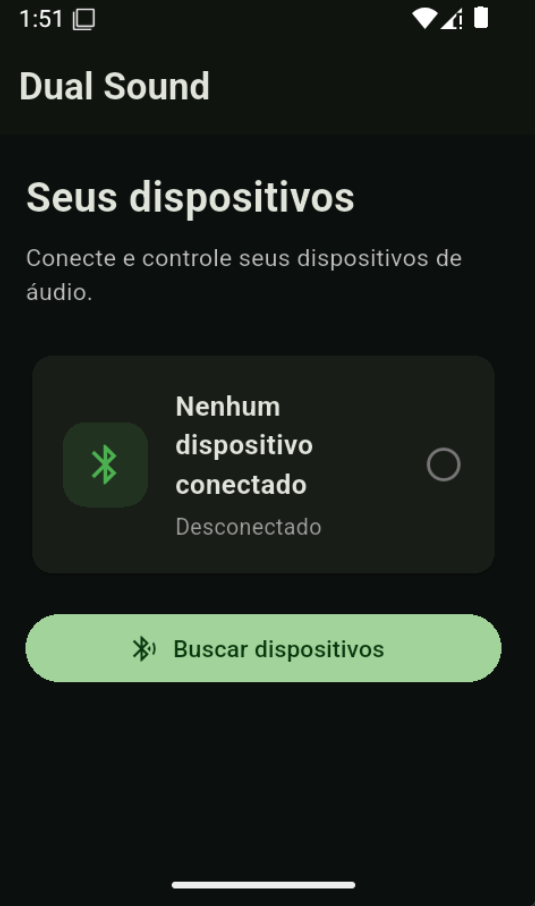

# 🎧 Dual Sound Controller

> 🚧 **Status do projeto:** em desenvolvimento

Aplicativo mobile desenvolvido em **Flutter** com a proposta de controlar e, futuramente, sincronizar dispositivos de áudio através de comunicação sem fio.

O **Dual Sound Controller** nasceu da ideia de criar uma solução inspirada em aplicações de sincronização de áudio, permitindo trabalhar com múltiplos dispositivos de áudio a partir de uma interface única e simples.

## 📋 Sumário

- [Sobre o projeto](#sobre-o-projeto)
- [Objetivos](#objetivos)
- [Conceito](#conceito)
- [BLE e áudio](#ble-e-áudio)
- [Arquitetura](#arquitetura)
- [Interface atual](#interface-atual)
- [Testes](#testes)
- [Tecnologias](#tecnologias)
- [Ambiente de desenvolvimento](#ambiente-de-desenvolvimento)
- [Como executar o projeto](#como-executar-o-projeto)
- [Estrutura do projeto](#estrutura-do-projeto)
- [Roadmap](#roadmap)
- [Controle de versão](#controle-de-versão)
- [Contexto acadêmico](#contexto-acadêmico)
- [Licença](#licença)
- [Autor](#autor)

---

## Sobre o projeto

O Dual Sound Controller é um projeto acadêmico e experimental desenvolvido para estudar, na prática, conceitos de:

- Desenvolvimento mobile com Flutter;
- Arquitetura de aplicações;
- Comunicação Bluetooth/BLE;
- Descoberta e gerenciamento de dispositivos;
- Comunicação entre dispositivos;
- Controle de características de dispositivos BLE;
- Organização de código e separação de responsabilidades;
- Testes automatizados;
- Versionamento com Git e GitHub.

A proposta final do projeto é permitir que o usuário visualize dispositivos compatíveis, estabeleça conexões e tenha uma interface centralizada para gerenciamento dos dispositivos de áudio.

---

## Objetivos

### Objetivo geral

Desenvolver uma aplicação mobile capaz de gerenciar dispositivos de áudio através de uma interface unificada, explorando comunicação Bluetooth de baixa energia e os recursos disponíveis nas plataformas móveis.

### Objetivos específicos

- [ ] Criar uma interface mobile intuitiva;
- [ ] Implementar descoberta de dispositivos Bluetooth/BLE;
- [ ] Identificar dispositivos encontrados;
- [ ] Permitir conexão e desconexão;
- [ ] Organizar dispositivos conectados em uma interface central;
- [ ] Investigar características e serviços BLE disponíveis;
- [ ] Implementar controles compatíveis com os dispositivos;
- [ ] Estudar possibilidades de sincronização de áudio;
- [ ] Implementar testes automatizados;
- [ ] Documentar a arquitetura e as decisões técnicas.

---

## Conceito

A ideia principal do Dual Sound é centralizar o gerenciamento de dispositivos de áudio em um único aplicativo.

A arquitetura planejada pode ser representada inicialmente da seguinte forma:

```text
                  ┌───────────────────┐
                  │  Dual Sound App   │
                  │      Flutter      │
                  └─────────┬─────────┘
                            │
               ┌────────────┴────────────┐
               │                         │
      ┌────────▼────────┐       ┌────────▼────────┐
      │  Bluetooth/BLE  │       │    Camada de    │
      │     Service     │       │      Áudio      │
      └────────┬────────┘       └─────────────────┘
               │
       ┌───────┴───────┐
       │               │
┌──────▼──────┐ ┌──────▼──────┐
│ Dispositivo │ │ Dispositivo │
│   BLE #1    │ │   BLE #2    │
└─────────────┘ └─────────────┘
```

A camada Bluetooth será responsável pela comunicação BLE, enquanto a camada de áudio será investigada separadamente devido às diferenças entre BLE, Bluetooth Classic e os mecanismos de saída de áudio das plataformas móveis.

---

## BLE e áudio

Um ponto importante do projeto é a diferença entre **Bluetooth Low Energy (BLE)** e os protocolos normalmente utilizados para transmissão de áudio Bluetooth.

O BLE pode ser utilizado para comunicação através de serviços e características GATT, porém isso não significa que uma aplicação Flutter possa simplesmente utilizar BLE para transmitir áudio para qualquer caixa de som Bluetooth convencional.

Por isso, o projeto trata duas áreas de forma separada:

```text
Bluetooth/BLE
 ├── Descoberta
 ├── Conexão
 ├── Serviços
 └── Características

Áudio
 ├── Saída de áudio
 ├── Bluetooth Classic / A2DP
 ├── Sincronização
 └── Recursos específicos de cada plataforma
```

A investigação dessa segunda camada faz parte do desenvolvimento do projeto.

---

## Arquitetura

A estrutura do projeto está sendo organizada para separar interface, componentes reutilizáveis, modelos e serviços. Os itens marcados como *(planejado)* ainda não foram implementados.

```text
lib/
├── main.dart
├── models/
│   └── bluetooth_device_model.dart   (planejado)
├── screens/
│   └── home_screen.dart
├── services/
│   └── bluetooth_service.dart        (planejado)
└── widgets/
    └── device_card.dart
```

### `main.dart`

Responsável pelo ponto de entrada da aplicação e pela configuração inicial do aplicativo.

Também define:

- Tema;
- Nome da aplicação;
- Configurações globais;
- Tela inicial.

### `screens/`

Contém as telas principais da aplicação.

Atualmente:

```text
screens/
└── home_screen.dart
```

A `HomeScreen` apresenta os dispositivos e será posteriormente conectada à camada Bluetooth.

### `widgets/`

Contém componentes reutilizáveis da interface.

Atualmente:

```text
widgets/
└── device_card.dart
```

O `DeviceCard` representa visualmente um dispositivo e seu estado de conexão.

### `models/`

Será utilizado para representar os dados utilizados pela aplicação.

Exemplo planejado:

```text
BluetoothDeviceModel
```

A utilização de modelos evita que regras de negócio e dados do Bluetooth fiquem diretamente acoplados à interface.

### `services/`

Concentrará a lógica de comunicação externa da aplicação.

O serviço Bluetooth será responsável por operações como:

```text
Buscar dispositivos
        ↓
Encontrar dispositivo
        ↓
Conectar
        ↓
Descobrir serviços
        ↓
Ler características
        ↓
Escrever características
        ↓
Desconectar
```

---

## Interface atual

A primeira versão da interface já possui uma tela inicial com:

- Nome da aplicação;
- Seção de dispositivos;
- Estado de conexão;
- Card de dispositivo;
- Botão para busca de dispositivos.

<p align="center">
  
</p>

Representação simplificada:

```text
┌──────────────────────────────────┐
│            Dual Sound            │
├──────────────────────────────────┤
│                                  │
│  Seus dispositivos               │
│  Conecte e controle seus         │
│  dispositivos de áudio.          │
│                                  │
│  ┌────────────────────────────┐  │
│  │ Nenhum dispositivo     [ ] │  │
│  │ conectado                  │  │
│  │ Desconectado               │  │
│  └────────────────────────────┘  │
│                                  │
│  ┌────────────────────────────┐  │
│  │    Buscar dispositivos     │  │
│  └────────────────────────────┘  │
│                                  │
└──────────────────────────────────┘
```

---

## Testes

O projeto utiliza o sistema de testes do Flutter através do pacote `flutter_test`.

Atualmente existe um teste de widget responsável por verificar a renderização dos principais elementos da tela inicial.

Exemplos de elementos verificados:

- `Dual Sound`
- `Seus dispositivos`
- `Nenhum dispositivo conectado`
- `Buscar dispositivos`

Para executar os testes:

```bash
flutter test
```

Resultado atual:

```text
+1: All tests passed!
```

---

## Tecnologias

| Tecnologia          | Utilização                               |
| ------------------- | ---------------------------------------- |
| **Flutter**         | Desenvolvimento da aplicação mobile      |
| **Dart**            | Linguagem de programação                 |
| **Android**         | Plataforma de testes atual               |
| **Bluetooth / BLE** | Comunicação com dispositivos compatíveis |
| **Git**             | Controle de versão                       |
| **GitHub**          | Hospedagem do código e documentação      |
| **VS Code**         | Ambiente principal de desenvolvimento    |
| **Android Studio**  | SDK, emulador e ferramentas Android      |

---

## Ambiente de desenvolvimento

O projeto está sendo desenvolvido inicialmente em:

| Item                  | Valor                |
| --------------------- | -------------------- |
| Sistema operacional   | Windows 11           |
| Framework             | Flutter              |
| Linguagem             | Dart                 |
| Plataforma de testes  | Android              |
| IDE                   | Visual Studio Code   |
| Controle de versão    | Git + GitHub         |

---

## Como executar o projeto

### Pré-requisitos

É necessário possuir:

- Flutter SDK (o Dart SDK já vem incluído);
- Android SDK;
- Android Studio ou ferramentas equivalentes;
- Um dispositivo Android físico ou emulador;
- Git.

Verifique a instalação do Flutter:

```bash
flutter doctor
```

### Passo a passo

Clone o projeto e entre na pasta:

```bash
git clone https://github.com/otzjoao/dual-sound-controller.git
cd dual-sound-controller
```

Instale as dependências:

```bash
flutter pub get
```

Verifique os dispositivos disponíveis:

```bash
flutter devices
```

Execute a aplicação:

```bash
flutter run
```

Para executar especificamente em um dispositivo Android:

```bash
flutter run -d <device_id>
```

---

## Estrutura do projeto

```text
dual-sound-controller/
├── android/              # Código e configuração Android
├── ios/                  # Código e configuração iOS
├── linux/                # Configuração Linux
├── macos/                # Configuração macOS
├── web/                  # Configuração Web
├── windows/              # Configuração Windows
├── lib/
│   ├── main.dart
│   ├── models/           # (planejado)
│   ├── screens/
│   ├── services/         # (planejado)
│   └── widgets/
├── test/
│   └── widget_test.dart
├── .gitignore
├── analysis_options.yaml
├── pubspec.yaml
├── pubspec.lock
└── README.md
```

---

## Roadmap

O desenvolvimento será realizado de forma incremental.

### Fase 1 — Estrutura inicial

- [x] Criar projeto Flutter
- [x] Configurar ambiente Android
- [x] Criar interface inicial
- [x] Separar `screens` e `widgets`
- [x] Criar teste de widget
- [x] Configurar Git
- [x] Publicar projeto no GitHub

### Fase 2 — Bluetooth/BLE

- [ ] Adicionar biblioteca BLE
- [ ] Criar modelo de dispositivo
- [ ] Criar serviço Bluetooth
- [ ] Implementar descoberta
- [ ] Exibir dispositivos encontrados
- [ ] Implementar conexão
- [ ] Implementar desconexão
- [ ] Descobrir serviços e características

### Fase 3 — Controle dos dispositivos

- [ ] Identificar características disponíveis
- [ ] Implementar leitura de dados
- [ ] Implementar escrita de dados
- [ ] Criar controle individual dos dispositivos
- [ ] Investigar controle de volume
- [ ] Criar interface de gerenciamento

### Fase 4 — Áudio

- [ ] Pesquisar limitações de áudio Bluetooth
- [ ] Avaliar Bluetooth Classic/A2DP
- [ ] Investigar sincronização entre dispositivos
- [ ] Avaliar possibilidades específicas de Android
- [ ] Avaliar possibilidades específicas de iOS
- [ ] Definir arquitetura final de áudio

### Fase 5 — Refinamento

- [ ] Melhorar interface
- [ ] Criar animações e estados de carregamento
- [ ] Melhorar tratamento de erros
- [ ] Adicionar testes
- [ ] Melhorar documentação
- [ ] Preparar versão demonstrável

---

## Controle de versão

O projeto utiliza Git para controle de versão.

As alterações são organizadas em commits seguindo uma convenção semântica, por exemplo:

```text
feat: adiciona descoberta de dispositivos BLE
fix: corrige estado de conexão
refactor: reorganiza serviço Bluetooth
test: adiciona testes para DeviceCard
docs: atualiza documentação
```

O repositório oficial está disponível em: <https://github.com/otzjoao/dual-sound-controller>

---

## Contexto acadêmico

O Dual Sound Controller também funciona como projeto de estudo para aplicação prática dos conhecimentos adquiridos durante a graduação em **Engenharia de Software**.

Além da implementação, o projeto busca aplicar conceitos de:

- Engenharia de requisitos;
- Arquitetura de software;
- Desenvolvimento mobile;
- Programação orientada a objetos;
- Separação de responsabilidades;
- Testes de software;
- Controle de versão;
- Documentação técnica;
- Pesquisa e análise de tecnologias.

---

## Licença

Este projeto encontra-se em desenvolvimento para fins acadêmicos e experimentais.

A definição de uma licença específica será realizada posteriormente.

---

## Autor

**João Victor Ortiz**

Projeto desenvolvido como parte dos estudos em **Engenharia de Software**.

---

> 🎧 **Dual Sound Controller**
>
> *Conectando tecnologia, software e áudio.*